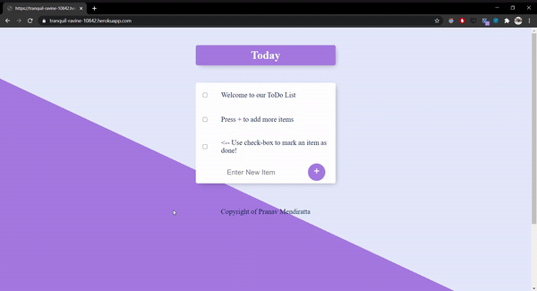

# ToDoList

## About-
- ToDoList is a dynamically updating daily schedule/ task keeper app, primarily developed using Node JS, Express and Mongoose.
- It has been deployed using Heroku cloud platform and is available for use for everyone.
- [Visit the Web App](https://tranquil-ravine-10842.herokuapp.com/)



## Tech Stack-
- HTML
- CSS
- EJS template engine
- Node JS
- Express JS
- Mongoose

## Environment Setup-

* Drop a :star: on the GitHub repository.
<br/>

* Download and install a code/ text editor.
    - Recommended-
        - [Download VS Code](https://code.visualstudio.com/download)
        - [Download Atom](https://atom.io/)
<br/>

* Download [Node Js and npm(Node package manager)](https://nodejs.org/en/) (when you download Node, npm also gets installed by default)
<br/>

* Clone the repository by running command
```
git clone https://github.com/ <your user-name> /ToDoist.git
```
in your git bash.
<br/>

* Run command `cd ToDoist`.
<br/>

* Run this command to install all dependencies for the project.
```
npm install
```
<br/>

* Run this command to start the project on local host 3000.
```
npm start
```
<br/>

* Open link to view the website in your browser window if it doesn't open automatically.
```
http://localhost:3000/
```
<br/>

* You can learn more about EJS template engine and its syntax to know how we can use it inside our HTML using the [documentation](https://ejs.co/#docs)
<br/>

* Now you are all set to use this project.
